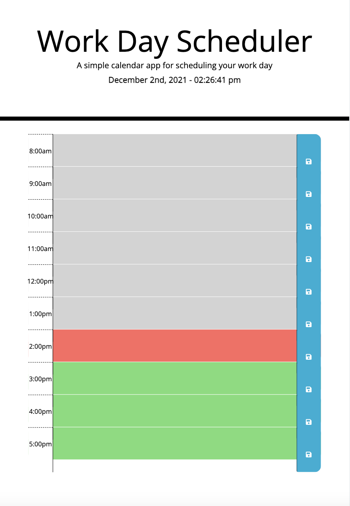

## WORK DAY SCHEDULER

## PURPOSE

The purpose of this project is to create a daily-planner application that allows the user to input and save events for each standard business hour of the day. Each time-block is color-coded to indicate whether it is in the past, present or future. This application runs in the browser and features dynamically updated HTML and CSS powered by jQuery.

## BUILT WITH

HTML

CSS

JavaScript

jQuery

## WEBSITE

https://jojochun.github.io/Work-Day-Scheduler/

## CONTRIBUTION

Made with ❤️ by Joanne Chun
